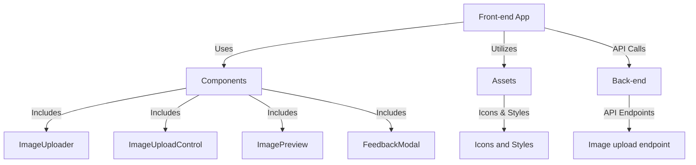
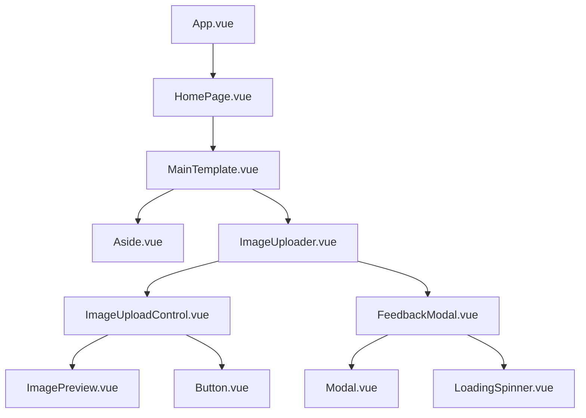
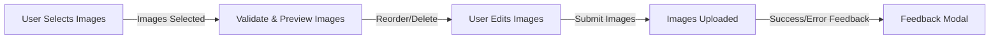

# System Design for Vue.js Image Uploader Application

## Overview

This document provides the system design overview of a Vue.js Image Uploader Application, including its application architecture, component hierarchy, and data flow.

## Application Architecture Diagram

This diagram represents the high-level structure of your application

## Component Hierarchy Diagram

This shows how components are structured and nested in this Vue.js application, following the Atomic Design principles. visualizes the relationship between atoms, molecules, organisms, templates, and pages.

## Data Flow Diagram

This diagram represents how data flows through the application, from the point of uploading an image to the handling of that image within various components.

---

This document provides a visual representation of the key aspects of the Image Uploader Application. The diagrams use Mermaid.js syntax and can be rendered using tools that support Mermaid.js.
