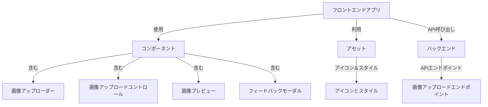
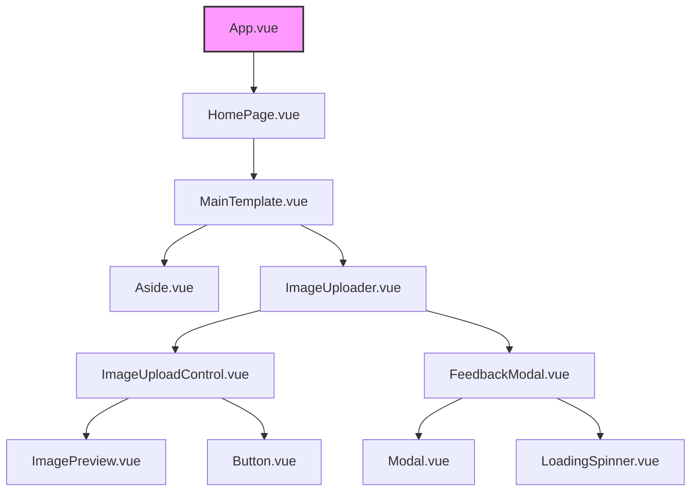

# Vue.js画像アップローダーアプリケーションのシステム設計

## 概要

本ドキュメントでは、Vue.jsを使用した画像アップロードアプリケーションのシステム設計概要を説明します。これには、アプリケーションのアーキテクチャ、コンポーネントの階層構造、およびデータフローが含まれます。

## アプリケーションアーキテクチャ図

この図は、アプリケーションの高レベルな構造を表しています。

## コンポーネント階層図

この図は、Vue.jsアプリケーション内でコンポーネントがどのように構造化され、ネストされているかを示します。原子デザインの原則に従い、原子、分子、有機体、テンプレート、ページ間の関係を視覚化します。

## データフロー図

この図は、画像のアップロードから、さまざまなコンポーネント内での画像の扱いに至るまでのアプリケーションを通じてのデータフローを表します。

---

本ドキュメントでは、画像アップローダーアプリケーションの主要な側面を視覚的に表現しています。図はMermaid.jsの構文を使用しており、Mermaid.jsをサポートするツールを使用してレンダリングできます。
